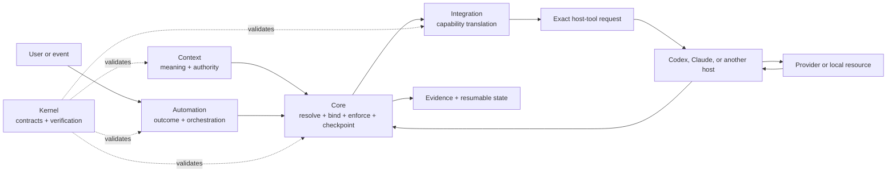
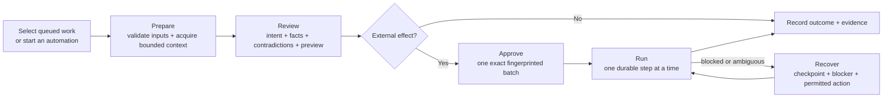

# Soter Harness

Soter is a user-owned harness for giving capable agent hosts durable context,
repeatable automations, and safe access to external systems.

It keeps domain meaning, operational behavior, provider integrations, authority,
and evidence explicit. Codex, Claude, and future runtimes are hosts of that
system—not its source of truth.

> **Status:** experimental. The repository proves substantial local and
> fixture-contained behavior, but connected readiness, end-to-end host behavior,
> and live health remain unknown until the applicable evidence exists.

## What is a harness?

Agent workflows often begin as useful prompts and scripts, then become difficult
to inspect, move, or trust. This harness turns accumulated behavior into a
versioned harness where a user can answer:

- What systems are installed, and why?
- What context and authority does this work use?
- Which capability is bound to which provider?
- What effects are allowed, gated, or prohibited?
- What has actually been proven for this exact configuration?
- Can interrupted work resume without reconstructing it from conversation?

This harness is not a model, a replacement for an agent host, or unrestricted
self-modifying software.

## How it fits together



The five Soter layers classify responsibility; they are not five sequential
runtime stages.

| Layer | Owns |
|---|---|
| **Kernel** | Authoring, validation, evaluation, packaging, and promotion contracts |
| **Core** | Resolution, bindings, effect policy, private checkpoints, evidence, and health reporting |
| **Context** | Domain concepts, schemas, relationships, policies, and authorities |
| **Automation** | Outcomes, triggers, orchestration, inputs, and required capabilities |
| **Integration** | Translation between portable capabilities and provider operations |

Host adapters project one resolved configuration into a host's native
instructions and tools. Automations remain provider-neutral and never depend on
host-qualified MCP tool names.

## The app

Soter Studio is the developer-launched desktop view of the same contracts used
by Core and the CLI. It does not maintain a second workflow engine.

| View | The question it answers |
|---|---|
| **Operate** | What work needs attention, and what is the exact next boundary? |
| **Explore** | What systems are installed, and how do they connect? |
| **Config** | What would change if I selected this host, pack, binding, or policy? |
| **Workflow** | What does an automation promise, require, and gate? |
| **Runs** | What happened, what evidence exists, and how can work recover? |

Valid, Ready, Verified, and Healthy remain separate proof dimensions across the
workspace. A valid graph is not automatically ready to run; a ready integration
is not automatically verified; old evidence is not current health.

### Operator flow

Prepare, Review, Approval, Run, and Recovery are state-dependent views of one
work record. They are not independent workflows.



The operator-facing order is deliberate: recognizable intent and the decision
come first; exact locks, graph fingerprints, context provenance, and evidence
remain available as supporting detail. The persistent proof rail reports
system-level truth, not the selected work item's lifecycle state.

## What works today

- **Provider-neutral pack graph.** Configurations explicitly select packs,
  versions, dependencies, bindings, authorities, sources, hosts, and effects.
- **Reproducible host projections.** The same portable configuration resolves
  into distinct, fingerprinted Codex and Claude locks and native tool routes.
- **Transactional configuration changes.** Configuration previews, expiring
  requests, exact confirmation, single-use start, durable checkpoints, apply,
  verification, rollback, and recovery share one Core authority model.
- **Deterministic host realization.** Core can preview and safely realize exact
  local host files with path confinement, manifest-last ownership, drift checks,
  and crash recovery. This proves local projection, not host launch or health.
- **Deterministic local distribution.** Kernel can build and independently
  verify content-addressed local pack releases and transparent bundles without
  network fetch, install authority, publisher identity, license, or trust claims.
- **Reviewed local pack installation.** Core can materialize already-local,
  independently verified pack releases through an expiring exact plan,
  single-use start, durable checkpoint, manifest-last ownership, verification,
  rollback, and recovery. It performs no fetch, package-manager, configuration,
  migration, host-realization, publication, or trust action.
- **Durable Core operations.** Exact host requests are checkpointed before
  dispatch and can be recovered after restart or context compaction.
- **Bounded context assembly.** Core loads declared sources through typed
  capabilities and records the exact basis used for a run.
- **Generated operator inputs.** Automation packs declare typed fields that
  Studio renders mechanically instead of receiving workflow-specific UI rules.
- **Private prepared work.** Studio and the CLI can validate inputs, perform
  fixture-contained reads, and produce review material without creating write
  authority.
- **Exact-scope effects.** Confirmation binds one change-set fingerprint;
  changed work requires new approval. Connected transaction machinery supports
  verification, recovery, and bounded compensation.
- **Honest proof states.** Local fixtures, provider probes, scenario evidence,
  readiness, verification, and health remain distinct claims.
- **Read-only workbenches.** Studio can inspect configuration changes, host
  realization, local releases, bundles, diagnostics, and evidence boundaries
  without silently obtaining execution authority.

Studio reads a privacy-minimized Core projection through a sandboxed Electron
boundary. Private review values use a separate selected-work read. Studio does
not read workspace files directly, call providers, invent provider payloads, or
turn displayed guidance into authority.

## Reference automations

| Automation | Demonstrates | Current stop boundary |
|---|---|---|
| **Project Pulse** | Grounded project, task, milestone, and policy inspection | Read-only; proposes no changes |
| **Meeting Intake** | Transcript and CRM grounding, cited judgment, exact task disposition, and approval-bound transaction mechanics | Contained preparation stops before judgment and writes; connected behavior requires separate evidence |
| **Task Capture** | Pack-owned inputs, exact project resolution, normalized policy, bounded deduplication, and a create preview | Stops before change set, approval, connected call, or provider write |
| **Email Triage** | Bounded mailbox reduction, injection-resistant review, private drafts and handoffs, exact review subsets, and draft-only effects | No send capability; connected writes remain approval- and checkpoint-bound |

These slices use the same generic Core boundary. Their fixture evidence proves
local behavior only; it does not establish connected credentials, provider
conformance, automation maturity, or live health.

## Quick start

Requirements: Node.js 20 or newer. Soter Studio's current toolchain requires
Node.js 20.19 or newer.

```bash
npm ci
npm run soter:verify
npm run soter:selftest
npm run soter:studio:dev
```

The Studio command launches an unbundled developer app against the current
repository. It is not a packaged installer.

## Verify the repository

Run the applicable legacy and target checks before treating a change as proven:

```bash
node .claude/scripts/check.mjs --all
node soter/kernel/verify.mjs --selftest
node soter/kernel/verify.mjs
node soter/core/cli.mjs selftest
node soter/core/cli.mjs fixtures --check
node soter/core/cli.mjs doctor \
  --lock soter/fixtures/meeting-intake/meeting-intake.lock.json
npm run soter:studio:check
npm run soter:studio:e2e
```

The offline doctor may correctly report `ready=unknown`, `verified=unknown`, or
`healthy=unknown`. Unknown is an honest result, not a generic failure or a green
claim.

For detailed CLI, MCP, probe, operation-plan, connected transaction, and Studio
developer workflows, see [soter/README.md](./soter/README.md).

## Repository map

```text
.claude/                 Working legacy Claude implementation
soter/
  kernel/                Contract graph validation and verification
  core/                  Resolution, runtime, checkpoints, evidence, CLI, MCP
  contexts/              Portable domain models and authority semantics
  automations/           Outcomes, inputs, orchestration, and preparation
  integrations/          Provider mappings and capability implementations
  packs/                 Selectable, versioned system boundaries
  configurations/        Desired selections, bindings, sources, and effects
  scenarios/             Behavioral expectations and invariants
  fixtures/              Contained examples and local proof
  migrations/            Explicit legacy-to-target migration state
  studio/                Electron and React operator/developer interface
```

Private resumable runtime state lives under `.soter/state`. It is ignored by
Git and must not be copied into packs, fixtures, commits, or shared
configurations.

## Migration direction

The `soter/` tree is the v2 target architecture. The `.claude/` tree remains the
working legacy implementation until each behavior is explicitly mapped,
reimplemented or retired, and proven against the target contracts.

The next cleanup line is v2.1: inventory the remaining legacy systems, map each
one to Kernel, Core, Context, Automation, Integration, or host responsibility,
standardize it on the target format, and remove a fallback only after its
replacement has equivalent or intentionally changed evidence. Legacy files are
inputs to that migration—not additional canonical layers.

## Documentation

- [ARCHITECTURE.md](./ARCHITECTURE.md) — product intent, responsibility
  boundaries, operating model, and migration direction
- [CONTRACTS.md](./CONTRACTS.md) — normative machine and runtime contracts
- [soter/README.md](./soter/README.md) — implementation status, detailed CLI
  workflows, probes, connected transactions, and Studio development
- [soter/STUDIO_ADAPTER.md](./soter/STUDIO_ADAPTER.md) — trusted desktop bridge
  and renderer boundary

The architecture and contracts are the target source of truth. Generated host
files, CLI reports, and graphical views must project that same structured model
rather than becoming independent definitions.

## Current boundaries

The target is intentionally conservative:

- connected provider probes are private, exact-lock, expiring runtime state;
- declared MCP routes do not prove authentication or availability;
- fixture execution does not prove connected provider or host behavior;
- prepared work is review evidence, not approval or permission to execute;
- a changed operation batch invalidates its prior confirmation;
- distribution inspection grants no install, publication, legal, or trust authority;
- host realization proves deterministic local files, not host launch or health;
- live provider writes and migrations require explicit user authority; and
- learning produces scoped candidates that must pass their own evidence and
  promotion gates.

The next major proof is a systematic v2.1 migration of legacy behavior onto the
same target contracts, with fallbacks retired only after explicit parity or an
intentional behavior change is validated.
