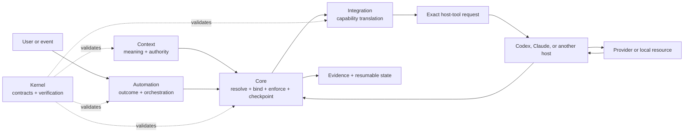
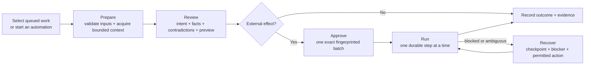

# Soter Harness

Soter is a user-owned harness for giving capable agent hosts durable context,
repeatable automations, and safe access to external systems.

It keeps domain meaning, operational behavior, provider integrations, authority,
and evidence explicit. Codex, Claude, and future runtimes are hosts of that
system—not its source of truth.

> **Status:** experimental. The repository proves substantial local and
> fixture-contained behavior, but connected readiness, end-to-end host behavior,
> and live health remain unknown until the applicable evidence exists.

## What is a harness?

Agent workflows often begin as useful prompts and scripts, then become difficult
to inspect, move, or trust. This harness turns accumulated behavior into a
versioned harness where a user can answer:

- What systems are installed, and why?
- What context and authority does this work use?
- Which capability is bound to which provider?
- What effects are allowed, gated, or prohibited?
- What has actually been proven for this exact configuration?
- Can interrupted work resume without reconstructing it from conversation?

This harness is not a model, a replacement for an agent host, or unrestricted
self-modifying software.

## How it fits together



The five Soter layers classify responsibility; they are not five sequential
runtime stages.

| Layer | Owns |
|---|---|
| **Kernel** | Authoring, validation, evaluation, packaging, and promotion contracts |
| **Core** | Resolution, bindings, effect policy, private checkpoints, evidence, and health reporting |
| **Context** | Domain concepts, schemas, relationships, policies, and authorities |
| **Automation** | Outcomes, triggers, orchestration, inputs, and required capabilities |
| **Integration** | Translation between portable capabilities and provider operations |

Host adapters project one resolved configuration into a host's native
instructions and tools. Automations remain provider-neutral and never depend on
host-qualified MCP tool names.

Portable Context ownership follows domain meaning rather than the current layout
of any provider workspace:

| Context pack | Owns |
|---|---|
| `context.crm` | Organizations, people, customer relationships, and CRM identity |
| `context.projects` | Projects, milestones, embedded work items, status, Decisions, Questions, and Project policy |
| `context.tasks` | Tasks, assignees, dates, lifecycle, and Task policy |
| `context.meetings` | Meetings, participants, commitments, summaries, and transcript relationships |
| `context.communications` | Provider-neutral communication scopes, conversations, participants, private untrusted content, and cross-context links |
| `context.communications.collaboration` | Workspace, channel, DM, thread, message, channel-directory, and ingestion-policy meaning |
| `context.email` | Mailbox windows, RFC822 identity, reduction, labels, drafts, triage, and the send-prohibited boundary |

These packs are independently selectable. Optional cross-domain links use typed
resource identities: a Project may reference an Organization, a Task may reference
a Project, and a Meeting or communication may reference any of them.
`integration.notion` maps each selected portable record family to the databases
configured by the user; Notion's database grouping never decides Context
ownership. Provider members do not automatically become CRM people.

## The app

Soter Studio is the developer-launched desktop view of the same contracts used
by Core and the CLI. It does not maintain a second workflow engine.

| View | The question it answers |
|---|---|
| **Operate** | What work needs attention, and what is the exact next boundary? |
| **Explore** | What systems are installed, and how do they connect? |
| **Config** | What would change if I selected this host, pack, binding, or policy? |
| **Workflow** | What does an automation promise, require, and gate? |
| **Runs** | What happened, what evidence exists, and how can work recover? |

Valid, Ready, Verified, and Healthy remain separate proof dimensions across the
workspace. A valid graph is not automatically ready to run; a ready integration
is not automatically verified; old evidence is not current health.

### Operator flow

Prepare, Review, Approval, Run, and Recovery are state-dependent views of one
work record. They are not independent workflows.



The operator-facing order is deliberate: recognizable intent and the decision
come first; exact locks, graph fingerprints, context provenance, and evidence
remain available as supporting detail. The persistent proof rail reports
system-level truth, not the selected work item's lifecycle state.

## What works today

- **Provider-neutral pack graph.** Configurations explicitly select packs,
  versions, dependencies, bindings, authorities, sources, hosts, and effects.
- **Reproducible host projections.** The same portable configuration resolves
  into distinct, fingerprinted Codex and Claude locks and native tool routes.
- **Transactional configuration changes.** Configuration previews, expiring
  requests, exact confirmation, single-use start, durable checkpoints, apply,
  verification, rollback, and recovery share one Core authority model.
- **Deterministic host realization.** Core can preview and safely realize exact
  local host files with path confinement, manifest-last ownership, drift checks,
  and crash recovery. This proves local projection, not host launch or health.
- **Deterministic local distribution.** Kernel can build and independently
  verify content-addressed local pack releases and transparent bundles without
  network fetch, install authority, publisher identity, license, or trust claims.
- **Reviewed local pack installation.** Core can materialize already-local,
  independently verified pack releases through an expiring exact plan,
  single-use start, durable checkpoint, manifest-last ownership, verification,
  rollback, and recovery. It performs no fetch, package-manager, configuration,
  host-realization, publication, or trust action.
- **Durable Core operations.** Exact host requests are checkpointed before
  dispatch and can be recovered after restart or context compaction.
- **Bounded context assembly.** Core loads declared sources through typed
  capabilities and records the exact basis used for a run.
- **Generated operator inputs.** Automation packs declare typed fields that
  Studio renders mechanically instead of receiving workflow-specific UI rules.
- **Governed development workflows.** Seven authoring, evaluation, and
  promotion workflows use closed `workflow-definition/v2`, `workflow-guide/v2`,
  evaluation-set, development-request, and development-result contracts. A
  definition is either inspectable or active and host-guided; only an
  evidence-qualified active guide may be realized into a host's private
  skill directory. Before following one, the host calls
  `soter_create_development_request` for the workflow, outcome, smallest local-
  effect subset, and exact targets. Core derives the active realized
  configuration. Each selected text target is read through
  `soter_read_development_target`, which accepts no caller path and returns
  private untrusted content in a dedicated model-visible MCP text block plus
  mirrored structured output, using bounded fingerprinted chunks without
  persisting or aggregating it. The initial cursor is
  `{index: 0, previous_material_fingerprint: null}`; each continuation pairs
  the returned `nextChunkIndex` with the preceding `materialFingerprint`. The
  host may retain each result in its private task transcript.
  `soter_inspect_development_run` reports the sanitized current, stale, or
  closed boundary. A realized guide alone is not runnable authority.
- **Private prepared work.** Studio and the CLI can validate inputs, perform
  fixture-contained reads, and produce review material without creating write
  authority.
- **Exact-scope effects.** Confirmation binds one change-set fingerprint;
  changed work requires new approval. Connected transaction machinery supports
  verification, recovery, and bounded compensation.
- **Honest proof states.** Local fixtures, provider probes, scenario evidence,
  readiness, verification, and health remain distinct claims.
- **Read-only workbenches.** Studio can inspect configuration changes, host
  realization, local releases, bundles, diagnostics, and evidence boundaries
  without silently obtaining execution authority.

Studio reads a privacy-minimized Core projection through a sandboxed Electron
boundary. Private review values use a separate selected-work read. Studio does
not read workspace files directly, call providers, invent provider payloads, or
turn displayed guidance into authority.

## Reference automations

| Automation | Demonstrates | Current stop boundary |
|---|---|---|
| **Project Capture** | Exact Projects policy and creation-profile grounding, current-schema validation, organization resolution, bounded duplicate review, one private create proposal, exact approval, single-use start, and content-inclusive read-back | Contained host simulation passes; manager and client-contact relations, arbitrary provider fields, automatic retry, and delete compensation are unavailable, while live Notion permission, behavior, readiness, verification, and health remain unknown |
| **Project Page Review** | Exact Project, related Tasks, portable policies, current page, and configured template-outline review with private selected-work findings | Read-only: it emits no proposal, approval, continuation, or write authority; live Notion permission, behavior, readiness, verification, and health remain unknown |
| **Project Page Reconciliation** | Exact Project property and bounded one-match page-text changes, selectable action subset, expiring approval, single-use start, ordered writes, read-back verification, and checkpoint-bound reconciliation | Contained host simulation passes; combined property/body writes are not externally atomic, ambiguous writes are never retried, automatic compensation is unavailable, and live Notion permission, behavior, readiness, verification, and health remain unknown |
| **Project Pulse** | Exact policy/project/task/document grounding, real milestone/work-item grammar, promoted-task progress, human-owned health review, complete-group approval, single-use start, ordered writes, and exact verification | Contained host simulation passes; health is checked rather than inferred, the two writes are ordered but not externally atomic, and live Notion permission, behavior, readiness, verification, and health remain unknown |
| **Meeting Intake** | Transcript plus independent Meetings, CRM, Projects, and Tasks grounding; cited judgment; exact task disposition; complete-group private review; approval; single-use start; and verified task-fold/summary sequencing | Contained host simulation passes; live transcript/Notion permission, behavior, judgment quality, readiness, verification, and health remain unknown |
| **Task Capture** | Exact project and authenticated-self resolution, governed policy, bounded deduplication, private proposal review, exact approval, single-use start, and verified create sequencing | Contained simulation passes and exact scoped canary observations exist for Codex and Claude; those observations do not establish broad readiness or health |
| **Organization Capture** | Current-schema classification, sector/tag separation, alias-aware deduplication, private proposal review, exact approval, single-use start, and verified organization creation | Contained host simulation passes; live Notion permission, behavior, readiness, verification, and health remain unknown |
| **Contact Capture** | Current Role/Status/Disposition/Authority/Tag observation, exact option matching, optional organization resolution, email-or-name deduplication, private proposal review, exact approval, single-use start, and verified person creation | Unmatched optional values are omitted and flagged; contained host simulation passes while live Notion permission, behavior, readiness, verification, and health remain unknown |
| **Drive Filing** | Exact registered-location policy, artifact metadata without content, current document schema, bounded duplicate reads, private placement/index review, provisional inbox handling, and human-only move instructions | Preparation-only: no connected shortcut or cross-provider index compiler, no approval/continuation, and no provider write; live Drive/Notion behavior remains unknown |
| **Feature Capture** | Required why, exact configured-board policy and current schema, deterministic type-specific body, bounded duplicate review, and private selected-work material | Preparation-only: dynamic embedded-board discovery and connected create authority are intentionally unavailable; live Notion behavior remains unknown |
| **Feature Definition** | Exact existing feature/body grounding, deterministic governed-section replacement, and mechanical preservation of why, Planned status, and relationships | Preparation-only: arbitrary templates, status mutation, approval/continuation, and connected update authority are unavailable; live Notion behavior remains unknown |
| **Repository Review** | Bounded source-backed capability review, exact Product duplicate comparison, and private Feature Capture handoffs | Preparation-only: no tooling page, Product write, handoff execution, approval, or continuation; connected repository behavior remains unknown |
| **Slack Channel Ingestion** | Complete channel identity review followed by exact selected-channel member enrichment, bot exclusion, and grounded CRM handoffs | Preparation and private plan compilation only: no Slack message or mutation capability, and no approval or execution authority is created by preparation |
| **Slack Conversation Review** | Policy-bounded selected-channel reads, complete pagination, exact rooted or selected threads, injection surfacing, and private selected-work content | Fixture-contained only today. Connected acquisition is mechanically unavailable because current message/thread routes return presentation prose instead of closed records and cursor facts; no Slack write, persistence proposal, approval, continuation, or retry authority exists |
| **Process Capture** | Exact Process policy and current schema grounding, role/service resolution, governed options, deterministic body construction, duplicate review, and explicit Task separation | Preparation-only: one fingerprint-only create may be reviewed, but no connected compiler, approval, continuation, or provider write exists |
| **Process Red Team** | Exact process/policy/schema/run grounding, five governed review lenses, reproduced criticals, ranked private findings, and explicit auto-fix refusal | Report-only preparation: no write or dispatch capability, proposal, approval, continuation, or recovery authority exists |
| **Email Triage** | Bounded mailbox reduction, injection-resistant review, private drafts and handoffs, exact review subsets, and draft-only effects | No send capability; connected writes remain approval- and checkpoint-bound |

These slices use the same generic Core boundary. Their fixture evidence proves
local behavior only; it does not establish connected credentials, provider
conformance, automation maturity, or live health.

## Quick start

Requirements: Node.js 20 or newer. Soter Studio's current toolchain requires
Node.js 20.19 or newer.

```bash
npm ci
npm run soter:verify
npm run soter:selftest
npm run soter:studio:dev
```

`npm run soter:selftest` is the only complete Core acceptance command. It runs
every registered suite once in isolated processes with eight workers by
default; use `npm run soter:selftest -- --jobs N` with `N` from 2 through 8 to
lower concurrency. Use `node soter/core/cli.mjs selftest --list-suites` to list
the canonical order and `--suite NAME` to rerun one failure. The bare CLI
aggregate is intentionally unavailable.

The Studio command launches an unbundled developer app against the current
repository. It is not a packaged installer.

Use the [connected developer-acceptance runbook](soter/acceptance/CONNECTED.md)
for exact private configuration, host realization, transient provider-call,
Task Capture, recovery, and claim boundaries. It is interactive by design and
does not turn host authentication or provider calls into Core-owned authority.

## Work-owned connected acquisition

Connected Context acquisition starts from one exact `operator-prepare` work
item created against `configurationBasis=private-active`. Every
acquisition-capable Automation—including Project Capture, Project Page Review,
and Project Page Reconciliation—uses the same generic commands:

```bash
node soter/core/cli.mjs operator-prepare \
  --configuration CONFIGURATION \
  --configuration-basis private-active \
  --automation AUTOMATION_ID \
  --input /absolute/private/input.json \
  --preparation-mode connected-acquisition \
  --json

node soter/core/cli.mjs operator-acquisition-prepare \
  --automation AUTOMATION_ID --work WORK_ID --json

node soter/core/cli.mjs operator-acquisition-finalize \
  --automation AUTOMATION_ID --work WORK_ID --checkpoint CHECKPOINT_ID --json
```

Use `--work WORK_ID`; do not supply a lock, run, mailbox query, provider
snapshot, or other source selector. Core reloads the selected work and its
private review material, derives the exact private desired configuration,
current active lock, host, and Core-owned durable run, and then prepares the
bounded reads. An internally supplied time or expected-host assertion can
revalidate that selection but cannot replace it.

The same rule applies below the workflow adapters. Generic capability and
operation-plan preparation is internal to Core and may reference only the exact
Core-created `0600` run under `.soter/state/runs`; no public CLI or MCP method
may originate an arbitrary capability or plan. The fixed provider-probe
preparation boundary remains public, but it cannot adopt a run document
authored in the repository or accept a caller-selected run path. Preparation
creates no approval, one-time start, provider-write, readiness, verification,
or health claim.

## Verify the repository

Run the target checks before treating a change as proven:

```bash
node soter/kernel/verify.mjs --selftest
node soter/kernel/verify.mjs
npm run soter:development-governance:selftest
npm run soter:selftest
node soter/core/cli.mjs fixtures --check
node soter/core/cli.mjs doctor \
  --lock soter/fixtures/meeting-intake/meeting-intake.lock.json
npm run soter:studio:check
npm run soter:studio:e2e
```

The offline doctor may correctly report `ready=unknown`, `verified=unknown`, or
`healthy=unknown`. Unknown is an honest result, not a generic failure or a green
claim.

For detailed CLI, MCP, probe, operation-plan, connected transaction, and Studio
developer workflows, see [soter/README.md](./soter/README.md).

## Repository map

```text
soter/
  kernel/                Contract graph validation and verification
  core/                  Resolution, runtime, checkpoints, evidence, CLI, MCP
  contexts/              Portable domain models and authority semantics
  automations/           Outcomes, inputs, orchestration, and preparation
  integrations/          Provider mappings and capability implementations
  packs/                 Selectable, versioned system boundaries
  configurations/        Desired selections, bindings, sources, and effects
  scenarios/             Behavioral expectations and invariants
  fixtures/              Contained examples and local proof
  studio/                Electron and React operator/developer interface
```

Private resumable runtime state lives under `.soter/state`. It is ignored by
Git and must not be copied into packs, fixtures, commits, or shared
configurations.

## Canonical source of truth

`soter/` is the operational architecture. Codex and Claude instructions, MCP
configuration, and active skills are generated into private consumer roots by
governed host realization; generated outputs never become canonical definitions.

## Documentation

- [ARCHITECTURE.md](./ARCHITECTURE.md) — product intent, responsibility
  boundaries, and operating model
- [CONTRACTS.md](./CONTRACTS.md) — normative machine and runtime contracts
- [soter/README.md](./soter/README.md) — implementation status, detailed CLI
  workflows, probes, connected transactions, and Studio development
- [soter/STUDIO_ADAPTER.md](./soter/STUDIO_ADAPTER.md) — trusted desktop bridge
  and renderer boundary

The architecture and contracts are the target source of truth. Generated host
files, CLI reports, and graphical views must project that same structured model
rather than becoming independent definitions.

## Current boundaries

The target is intentionally conservative:

- connected provider probes are private, exact-lock, expiring runtime state;
- declared MCP routes do not prove authentication or availability;
- fixture execution does not prove connected provider or host behavior;
- prepared work is review evidence, not approval or permission to execute;
- a changed operation batch invalidates its prior confirmation;
- distribution inspection grants no install, publication, legal, or trust authority;
- host realization proves deterministic local files, not host launch or health;
- live provider writes require explicit user authority; and
- learning produces scoped candidates that must pass their own evidence and
  promotion gates.

Private host outputs are deliberately absent from Git. A developer or test
consumer selects an exact configuration and realizes Codex or Claude files into
an isolated consumer root. Existing unmanaged files are collisions, not inputs
to generation, and generated files never become canonical source.
